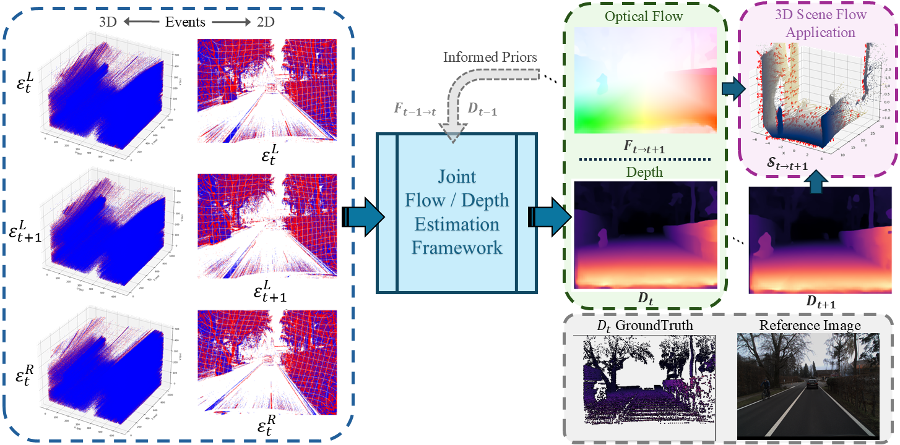
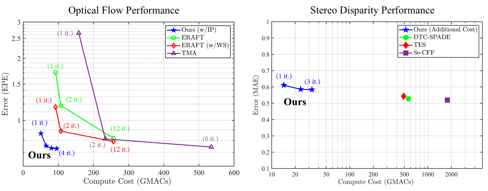

# E-FlowDepth


This is the official repository of the paper [**Efficient Joint Estimation of Optical Flow and Stereo Disparity With Event Cameras**](https://ieeexplore.ieee.org/stamp/stamp.jsp?tp=&arnumber=11456049) published in IEEE Robotics and Automation Letters (RA-L). This paper introduces a learning-based method to jointly estimate optical flow and stereo disparity from events with high computational efficiency.

---

## Overview

This work aims towards achieving high computational efficiency for the tasks of optical flow and disparity/depth estimation, which often are required simultaneously in many robotics applications. High computational efficiency is achieved by introducing shared feature encoders, a Bidirectional Mamba (Bi-Dir Mamba) module, and informed priors (IP) for iterative refinement. Bi-Dir Mamba enhances feature expressiveness with low computational overhead, while IP leverages temporally propagated estimates to reduce the number of refinement iterations. With only two iterations, our method matches [TMA](https://github.com/ispc-lab/TMA) with an 8× reduction in compute and achieves competitive disparity performance with 21× less compute than [TES](https://github.com/mickeykang16/TemporalEventStereo).

<p align="center">
     <br>
</p>

<p align="center">
     <br>
</p>

---

## Environment Setup

We recommend using a fresh Conda environment:

```bash
conda create -n eflowdisp python=3.12 -y
conda activate eflowdisp
```

Install CUDA toolkit:
```bash
conda install -c nvidia cuda-toolkit=12.1 cuda-nvcc=12.1 -y
```

Install PyTorch and dependencies:
```bash
pip install torch==2.4.0 torchvision==0.19.0 torchaudio==2.4.0 --index-url [https://download.pytorch.org/whl/cu121](https://download.pytorch.org/whl/cu121)
pip install -r requirements.txt --no-build-isolation
```

Install ImageIO FreeImage plugin:
```bash
python -c "import imageio; imageio.plugins.freeimage.download()"
```

Download this repository:
```bash
git clone https://github.com/AhmedHumais/E-FlowDepth.git
```
---

## Dataset

### DSEC Test Data
Download the DSEC test data using the provided script:
```bash
bash download_dsec_test_data.sh
```

Upon successful download it should result in the following directory structure.
```text
data/
└── dsec/
    └── test/
        ├── event_data/
        │   ├── interlaken_00_a/
        │   │   ├── events/
        │   │   │   ├── left/
        │   │   │   │   ├── events.h5
        │   │   │   │   └── rectify_map.h5
        │   │   │   └── right/
        │   │   │       ├── events.h5
        │   │   │       └── rectify_map.h5
        │   │   └── image_timestamps.txt
        │   └── interlaken_00_b/
        │       └── ...    
        ├── test_disparity_timestamps/
        │   ├── interlaken_00_a.csv
        │   └── ...
        └── test_forward_optical_flow_timestamps/
            ├── interlaken_00_b.csv
            └── ...
```

## Checkpoints

Download the checkpoints from [E-FlowDepth_Checkpoints](https://kuacae-my.sharepoint.com/:f:/g/personal/muhammad_ahumais_ku_ac_ae/IgALVon6Ej_ZTbeGyAFg8kf0AcA3HxiLPRqWOZ1Rke-_Bg8?e=QvLEPt) and place them in `checkpoints/` directory:
```text
checkpoints/checkpoint.pth
```

---

## Configuration

Inference is configured using a YAML file. An example is provided in `configs/config_default.yaml`.

## Evaluation

Use the `test_dsec.py` script to run evaluation.
* For optical flow task only, run:
```bash
python test_dsec.py --config config_default.yaml --task flow
```
* For disparity task:
```bash
python test_dsec.py --config config_default.yaml --task flow
```
* For joint estimation:
```bash
python test_dsec.py --config config_default.yaml --task both
```
* To run evaluation for the network trained on DSEC dataset from scratch:
```bash
python test_dsec.py --config config_scratch.yaml --task flow
```
* [Optionally] you can also specify number of refinement iterations using `--flow-iters` or `--disp-iters`, for example:
```bash
python test_dsec.py --config config_default.yaml --task flow --flow-iters 3
```

## Output Structure
Results are written under the configured `results_path`:
```text
results/
├── submission_flow/
│   ├── interlaken_00_b/
│   │   ├── 000820.png
|   |   └── ... 
│   ├── interlaken_01_a/
│   │   └── ... 
|   └── ... 
└── visualization_flow/
    ├── interlaken_00_b/
    │   ├── 000002.png
    |   └── ... 
    ├── interlaken_01_a/
    │   └── ... 
    └── ... 
```
The directory `results/submission_flow` contains the results that are uploaded to online [DSEC](https://dsec.ifi.uzh.ch/uzh/dsec-flow-optical-flow-benchmark/) benchmark for evaluation. Similarly, for disparity also.

---

## Citation

If you find this work useful, please cite:
```bibtex
@article{humais2026efficient,
  author={Humais, Muhammad Ahmed and Javed, Sajid and Zweiri, Yahya},
  journal={IEEE Robotics and Automation Letters}, 
  title={Efficient Joint Estimation of Optical Flow and Stereo Disparity With Event Cameras}, 
  year={2026},
  volume={11},
  number={5},
  pages={6026-6033},
  doi={10.1109/LRA.2026.3677749}
}
```

---

## Acknowledgements

Parts of this codebase are adapted from the [E-RAFT](https://github.com/uzh-rpg/E-RAFT) repository. We thank the authors for making their implementation publicly available and for supporting reproducible research in event-based vision.